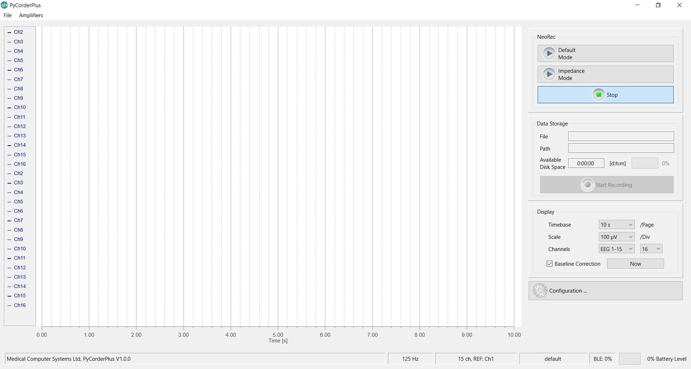

# PyCorderPlus

`PyCorderPlus` is a continuation of `PyCorder` (now unsupported by [BrainProducts](https://www.brainproducts.com/)) migrated to a new version of `Python3` and its new libraries.

PyCorderPlus supports the following amplifiers:
* [NeoRec cap](https://mcscap.com/catalog/mobile-system-neoreccap-16/system-neorec-cap-16-base/)
* [NeoRec 21](https://mcscap.com/catalog/mobile-system-neorec-cap-21/system-neorec-cap-21-professional/)
* [NeoRec 21 mini](https://mcscap.com/catalog/mobile-system-neorec-cap-21-mini/system-neorec-cap-21-mini-professional/)
* [actiCHamp Plus](https://brainvision.com/products/actichamp-plus/)

## Functional

`PyCorderPlus` supports the following functions for all supported amplifiers:
1. Set up the amplifier
2. Real-time EEG display
2. Real-time impedance display
3. EEG filtering
4. Montage of channels
5. Save the EEG in the format `.eeg` ([Brain Products format](https://www.brainproducts.com/support-resources/brainvision-core-data-format-1-0/))


## Installation

1. Install [Python](https://www.python.org/downloads/)
2. Download the `PyCorderPlus` program code
2. In command line open directory with code of `PyCorderPlus`
3. Run in command line `install.bat`

Example:
```commandline
C:\User\Name\PyCorderPlus> install.bat
```

## Running

1. In command line open directory with code of `PyCorderPlus`
2. Run `run.bat`

Example:
```commandline
C:\User\Name\PyCorderPlus> run.bat
```

Alternative way to run the program:

```commandline
C:\User\Name\PyCorderPlus> .\venv\Scripts\activate
C:\User\Name\PyCorderPlus> python -m main
```


## Dependencies

### Amplifier Drivers

* Driver for [actiCHamp Plus](actiCHampDriver)
* To work with NeoRec amplifiers, you do not need to install drivers, the amplifiers work via Bluetooth


### Requirements
* Python 3.11

### System requirements
* OS: Windows 10, 11

### Requirements for libraries
You can find other requirements for the library in the [requirements.txt](requirements.txt).

## Copyrights
### Main code base
Copyright © 2010, Brain Products GmbH, Gilching, for original PyCorder modules

Copyright © 2024, Medical Computer Systems Ltd, for modules rewritten to a new version of Python

### PyCorderPlus NeoRec Recorder
Copyright © 2024, Medical Computer Systems Ltd, for modules for receiving and processing data from NeoRec amplifiers

## License
See included [LICENSE](LICENSE) file for more details about licensing terms.

## Release History
### v1.0.0
* Modules completely rewritten: `modbase.py`, `storage.py`, `impedance.py`, `filter.py`, `tools.py`, `trigger.py`.
* Modules partially rewritten: `amplifier_actichamp.py`, `actichamp_w.py`, `display.py`.
* Added support for NeoRec amplifiers.

## List of found errors
1. When connecting a NeoRec cap, it is possible to double the number of channels in the display.

